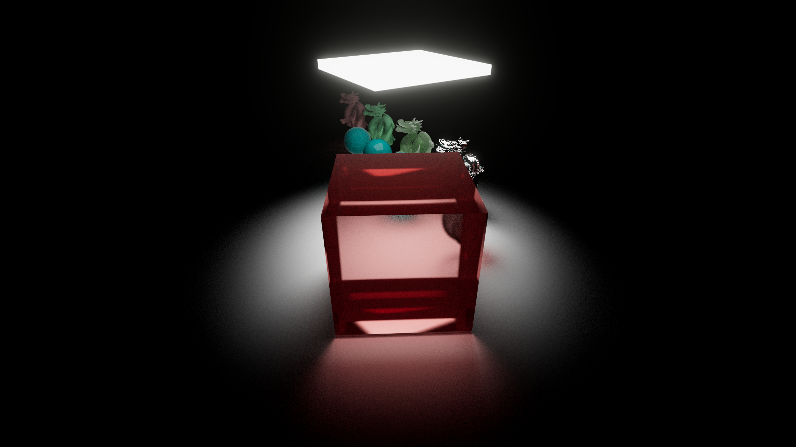
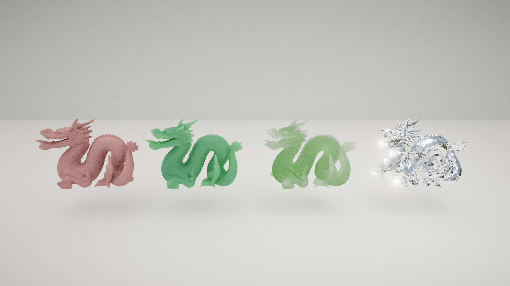

<h1 align="center">Halogen Pathtracer</h1>

  

Halogen is a software path tracer written in HLSL and C#. It features full support for triangle meshes, environment cubemaps, and transmissive materials. It exists right now as a Unity project, mainly for the convienience and debugging ease of the Unity Editor. (ie. no part of the rendering is handled by Unity) 

# Features

- BVH acceleration structures for meshes
- Focal blur
- Environement cubemaps with simple importance sampling
- Seperate bounce limits for diffuse, glossy, and transmissive rays
- Blackman-Harris filtering for antialiasing
- Owen scrambled Sobol sampling based on "Practical Hash-based Owen Scrambling", by Brent Burley & Walt Disney Animation Studios
- Debug Views (Albedo, Triangle Intersections, etc..)
- Nested Dielectrics support based on "Simple Nested Dielectrics in Ray Traced Images", by Schmidt & Budge
- A material model supporting transmission, absorption, refraction, diffuse & specular reflection, as well as emission
- Implements Russian Roulette to improve Monte Carlo efficiency as described in PBRT v4

# Screenshots

  
  
  

